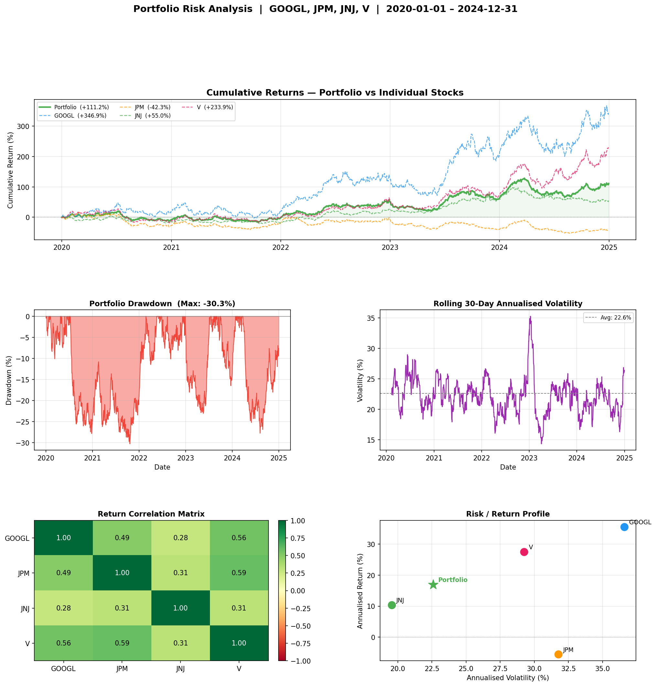

# 📉 portfolio-risk-analysis

A beginner-to-intermediate quantitative finance project that builds an **equal-weighted portfolio** from four S&P 500 stocks across different sectors — GOOGL (Tech), JPM (Finance), JNJ (Healthcare), and V (Payments) — and analyses its risk profile using industry-standard metrics. The project computes portfolio volatility, Sharpe ratio, maximum drawdown, and cumulative returns from five years of daily price data downloaded via `yfinance`. A five-panel dashboard visualises cumulative performance vs individual stocks, drawdown history, rolling volatility, a return correlation heatmap, and a risk/return scatter plot. This project demonstrates how diversification across uncorrelated sectors can reduce portfolio risk relative to holding any single stock.

---

## What it computes

| Metric | Description |
|---|---|
| **Cumulative Return** | Total portfolio growth over the period |
| **Annualised Return** | Average yearly return |
| **Annualised Volatility** | Standard deviation of returns × √252 |
| **Sharpe Ratio** | Risk-adjusted return above the risk-free rate |
| **Max Drawdown** | Largest peak-to-trough decline |
| **Correlation Matrix** | Pairwise return correlations between stocks |

---

## Quickstart

**Google Colab (recommended)**

[](https://colab.research.google.com/)

1. Open a new notebook at [colab.new](https://colab.new)
2. Paste the full contents of `portfolio_risk.ipynb` into a cell
3. Uncomment the first line: `!pip install yfinance -q`
4. Run with `Shift + Enter`

**Run locally**

```bash
git clone https://github.com/YOUR_USERNAME/portfolio-risk-analysis
cd portfolio-risk-analysis
pip install yfinance pandas numpy matplotlib
python portfolio_risk.ipynb
```

---

## Configuration

Edit the constants at the top of `portfolio_risk.ipynb`:

```python
TICKERS   = ["GOOGL", "JPM", "JNJ", "V"]   # any valid Yahoo Finance tickers
START     = "2020-01-01"
END       = "2024-12-31"
RISK_FREE = 0.04       # annual risk-free rate (e.g. US T-bill yield)
CAPITAL   = 10_000     # hypothetical starting investment ($)
WEIGHTS   = np.array([0.25, 0.25, 0.25, 0.25])  # must sum to 1.0
```

To add more stocks, extend `TICKERS` and update `WEIGHTS` so they still sum to `1.0`.

---

## Output

Running the script prints a full performance summary table and saves `portfolio_risk_results.png` — a five-panel dashboard showing:

- **Cumulative returns** — portfolio (solid) vs each stock (dashed), all on the same axis
- **Drawdown chart** — visualises every peak-to-trough decline over the period
- **Rolling 30-day volatility** — shows how portfolio risk varied through time
- **Correlation heatmap** — pairwise return correlations with colour coding
- **Risk/return scatter** — plots each stock and the portfolio on a volatility vs return axis

---
## Results

Example portfolio cumulative returns and stock contributions:



## Key Limitations

- **Equal weighting** — real portfolios use optimised weights (e.g. mean-variance optimisation via the efficient frontier); equal weighting is a simplification
- **No rebalancing** — the portfolio is set once at the start; a real implementation would rebalance monthly or quarterly as weights drift
- **Normal return assumption** — Sharpe ratio and volatility assume normally distributed returns; real returns have fat tails and skew
- **Backward-looking only** — all metrics are computed on historical data; past risk/return does not predict the future
- **No transaction costs** — rebalancing in practice incurs fees, slippage, and tax implications not modelled here
- **Survivorship bias** — hand-picking well-known, still-listed S&P 500 stocks inflates backtest results

---

## Stack

`Python` · `pandas` · `numpy` · `matplotlib` · `yfinance`

---

## License

MIT
